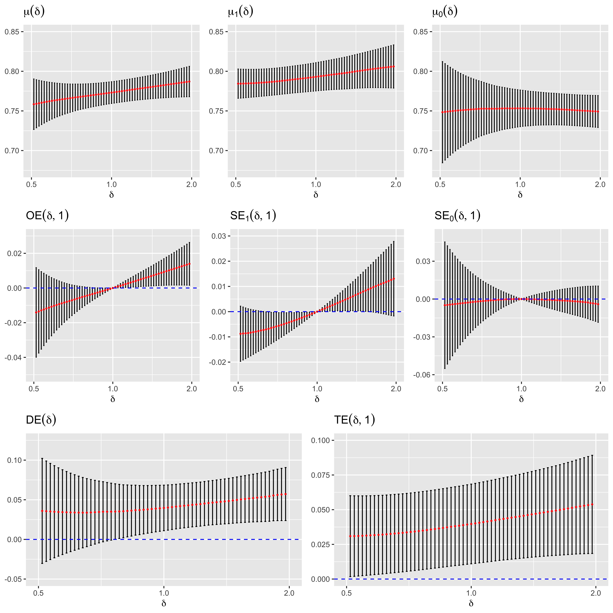

# ClusterIPS
Repository for the paper (in prep) "**Efficient Nonparametric Estimation of Incremental Propensity Score Effects with Clustered Interference**"

- Developed nonparametric estimation of causal network effects under interference based on semiparametric efficiency theory and empirical process
- Used ensemble of nonparametric and ML models (spline regression, GAM, boosting, Random Forest, neural net) via SuperLearnear in R
- Assessed the effect of water, sanitation, and hygiene (WASH) facilities on diarrhea incidence among children, allowing for interference within census blocks

## :file_folder: Data

### Senegal DHS data [(ANSD and ICF, 2020)](https://www.dhsprogram.com/pubs/pdf/FR368/FR368.pdf)
- Sociodemographic, enviromental, and health-related survey on household members 
- Used to assess the effect of WASH facilities on diarrhea incidence among children, allowing for interference within census blocks
- Download the data from [https://dhsprogram.com/data/available-datasets.cfm](https://dhsprogram.com/data/available-datasets.cfm) 
(requires data request submission) and place the datasets in "Data/DHS/" by following procedure:
  - Senegal: Continuous DHS, 2015 -> (download) SNKR7HDT.ZIP -> (uncompress) SNKR7HFL.DTA -> (rename) senegal15.DTA
  - Senegal: Continuous DHS, 2016 -> (download) SNKR7IDT.ZIP -> (uncompress) SNKR7IFL.DTA -> (rename) senegal16.DTA
  - Senegal: Continuous DHS, 2017 -> (download) SNKR7ZDT.ZIP -> (uncompress) SNKR7ZFL.DTA -> (rename) senegal17.DTA
  - Senegal: Continuous DHS, 2018 -> (download) SNKR81DT.ZIP -> (uncompress) SNKR81FL.DTA -> (rename) senegal18.DTA
  - Senegal: Continuous DHS, 2019 -> (download) SNKR8BDT.ZIP -> (uncompress) SNKR8BFL.DTA -> (rename) senegal19.DTA

## :file_folder: Code

### :page_facing_up: Preprocessing.R
- By running this R file, the DHS dataset is cleaned.
- Preprocessed dataset will be saved as "Data/DHS/HHData.Rdata" and used in "Code/Estimation.R".

### :page_facing_up: Estimator.R
- R function for Nonparametric efficient sample splitting estimator under the Cluster Incremental Propensity Score policy.

### :page_facing_up: Estimation.R
- Requires "Code/Estimator.R" and "Data/DHS/HHData.Rdata".
- Senegal DHS data is analyzed to estimate the causal estimands under the Cluster IPS policy.
- The code will take a lot of time, so it is recommended to use parallel computing.
- To parallelize, submit jobs in for(s in 1:S){...} separately.
- Estimates and SE estimates will be saved at "Data/DHS/result.Rdata".

### :page_facing_up: Visualization.R
- Requires "Data/DHS/result.Rdata".
- Causal estimands under the Cluster IPS policy estimation results are visualized.
- Generated figures are saved under "Data/DHS/".

## :file_folder: Simulation

### :file_folder: scenario_cor
Simulation for Scenario 1: correctly specified nuisance functions

> #### :file_folder: Code
> - :page_facing_up: Estimand_Cor.R: Causal estimands approximation
> - :page_facing_up: Estimator_Cor.R: Proposed esimators computation
> - :page_facing_up: Helpfunc_Cor.R: R functions for estimand and estimator computation
> - :page_facing_up: ReadResult_Cor.R: Read and summarize simulation result
> 
> #### :file_folder: Data_parallel
> - Simulated data from parallel computing
> 
> #### :file_folder: Result_parallel
> - Simulation result for Scenario 1

### :file_folder: scenario_mis
Simulation for mis-specified nuisance functions scenario

> #### :file_folder: Code
> - :page_facing_up: Estimand_Mis.R: Causal estimands approximation
> - :page_facing_up: Estimator_Mis.R: Proposed esimators computation
> - :page_facing_up: Helpfunc_Mis.R: R functions for estimand and estimator computation
> - :page_facing_up: ReadResult_Mis.R: Read and summarize simulation result
> 
> #### :file_folder: Data_parallel
> - Simulated data from parallel computing
> 
> #### :file_folder: Result_parallel
> - Simulation result for Scenario 2

### :page_facing_up: siumulation.xlsx
Simulation results for both Scenarios organized

## Result

- Household WASH facilities protect children from diarrhea, and the protective effects increase when neighboring households also have WASH facilities. 
- Childrenin WASH households can gain additional protective effect as more neighboring households are equipped with WASH facilities, which is not true for children from households without WASH facilities. 
- Therefore, it is important to install as many WASH facilities as possible
to prevent diarrhea among children.
